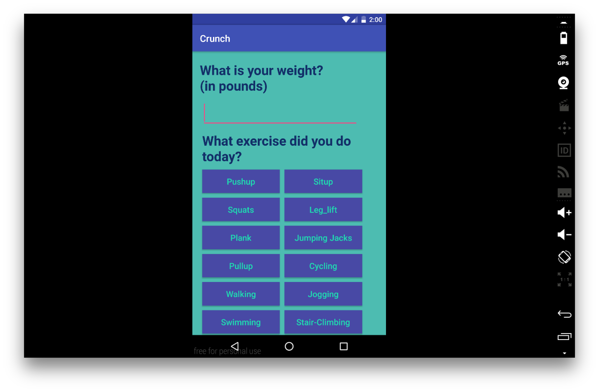
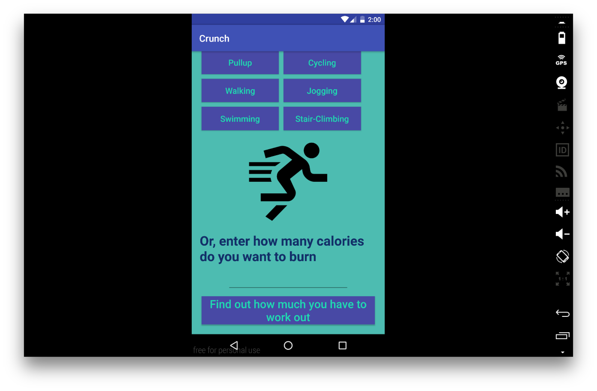
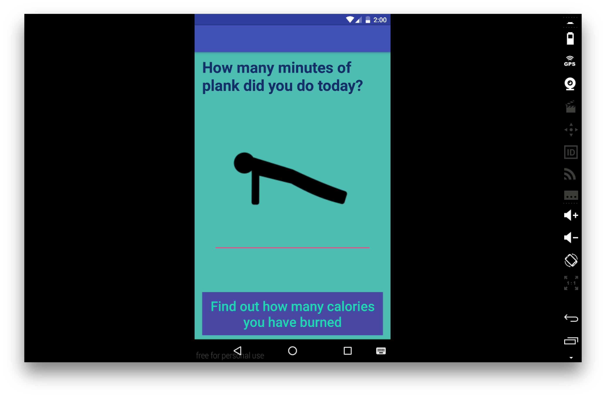
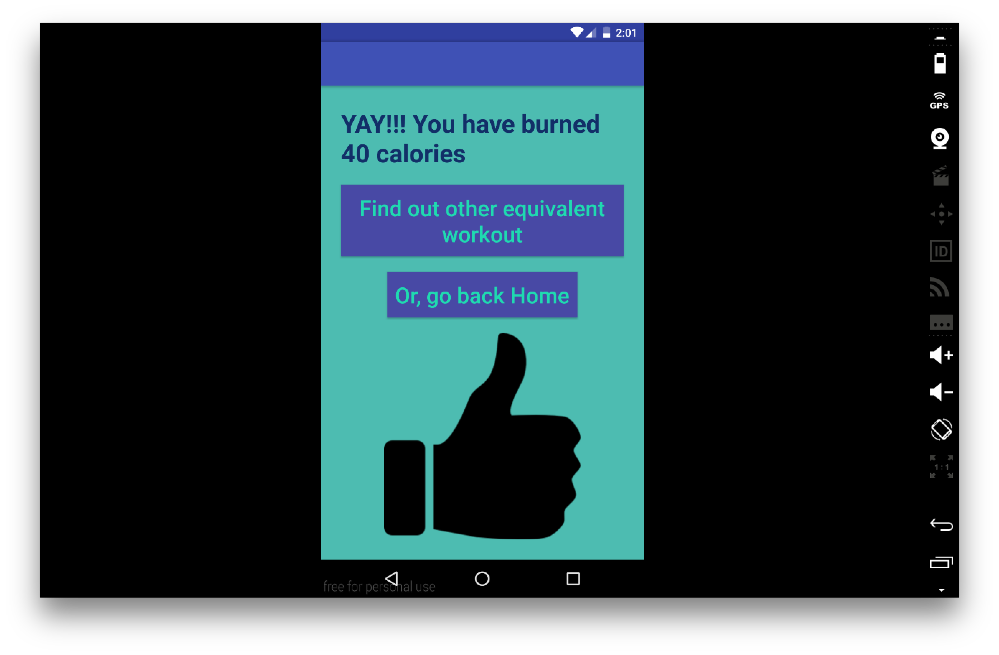
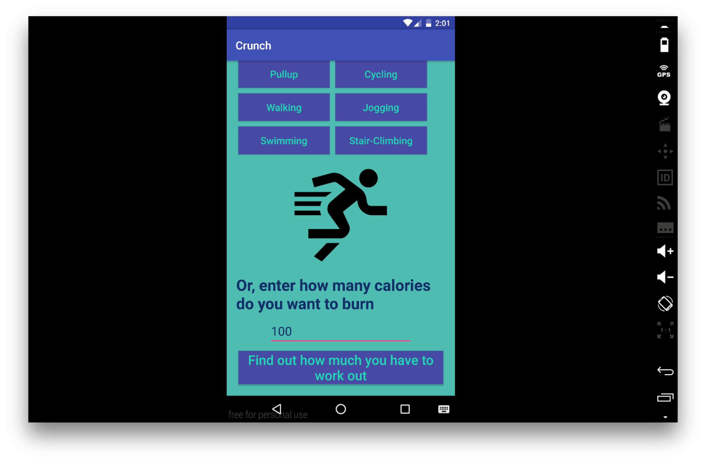
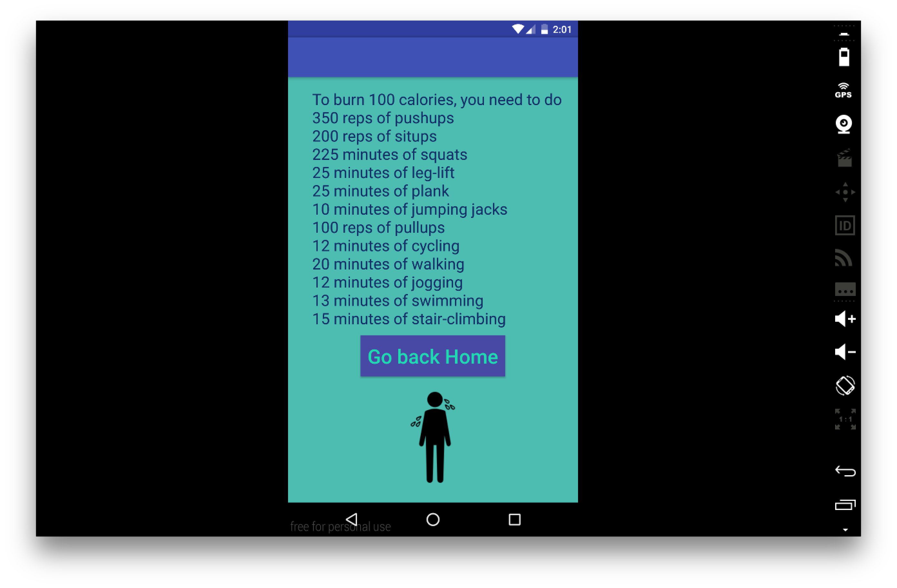

# PROG 01: Crunch Time

## Overview

FitnessBuddy is an application that tells you how many calories you have burned by exercising. This application first asks you enter your weight. Then it asks you what exercise you did and your response takes you to the next activity. Here you are asked to enter the number of reps/minutes of the exercise you did, this shows you the amount of calories you have burned. Then you can find the equivalent workout to burn the same amount of calories or go back home. Also, you can enter the number of calories you want and this application tells you how many reps/minutes of each exercise you have to do.

## Authors

Alagu Sanjana Haribhaskaran (alagusanjana@berkeley.edu)

## Demo Video

See FitnessBuddy App https://youtu.be/vaLyycomeEQ

## Screenshots

